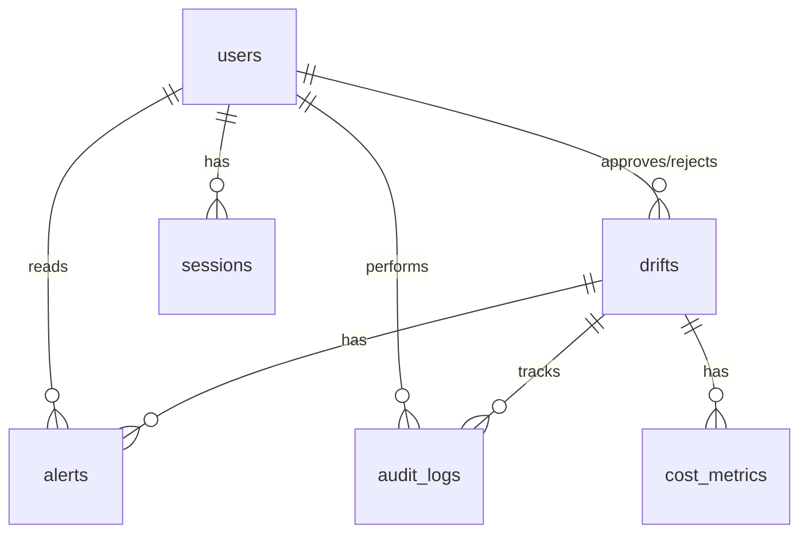

# DriftSentry Database Schema Documentation

## Overview

DriftSentry uses PostgreSQL 14+ with the following tables:

| Table | Purpose |
|-------|---------|
| `users` | User accounts and authentication |
| `drifts` | Infrastructure drift detections |
| `alerts` | Notifications for drift events |
| `audit_logs` | Immutable action trail |
| `cost_metrics` | Time-series cost data |
| `sessions` | JWT refresh token management |

---

## Entity Relationship Diagram



---

## Tables

### users

Authentication and authorization for system users.

| Column | Type | Constraints |
|--------|------|-------------|
| id | UUID | PK, default gen_random_uuid() |
| email | VARCHAR(255) | UNIQUE, NOT NULL, email format |
| password_hash | VARCHAR(255) | NOT NULL |
| first_name | VARCHAR(100) | - |
| last_name | VARCHAR(100) | - |
| avatar_url | VARCHAR(500) | - |
| role | VARCHAR(50) | NOT NULL, default 'viewer', CHECK IN (admin, engineer, viewer) |
| is_active | BOOLEAN | default true |
| created_at | TIMESTAMPTZ | default now() |
| updated_at | TIMESTAMPTZ | auto-updated |
| last_login_at | TIMESTAMPTZ | - |

**Indexes:** email, created_at DESC, role

---

### drifts

Core entity representing detected infrastructure drift.

| Column | Type | Constraints |
|--------|------|-------------|
| id | UUID | PK |
| resource_id | VARCHAR(255) | NOT NULL (e.g., "i-0123456789abcdef0") |
| resource_type | VARCHAR(50) | NOT NULL (EC2, RDS, S3, IAM_ROLE, SECURITY_GROUP) |
| region | VARCHAR(50) | NOT NULL |
| account_id | VARCHAR(12) | - |
| expected_state | JSONB | NOT NULL |
| actual_state | JSONB | NOT NULL |
| difference | JSONB | NOT NULL |
| severity | VARCHAR(20) | NOT NULL, CHECK IN (critical, warning, info) |
| cost_impact_monthly | DECIMAL(10,2) | default 0 |
| status | VARCHAR(50) | NOT NULL, CHECK IN (detected, triaged, approved, rejected, resolved) |
| detected_at | TIMESTAMPTZ | NOT NULL |
| detected_by | VARCHAR(50) | NOT NULL, CHECK IN (scheduler, manual, api) |
| approved_at | TIMESTAMPTZ | - |
| approved_by | UUID | FK → users(id) |
| approval_reason | TEXT | - |
| rejected_at | TIMESTAMPTZ | - |
| rejected_by | UUID | FK → users(id) |
| rejection_reason | TEXT | - |
| resolved_at | TIMESTAMPTZ | - |
| resolved_how | VARCHAR(50) | CHECK IN (auto-remediate, manual-fix, acknowledged) |
| created_at | TIMESTAMPTZ | default now() |
| updated_at | TIMESTAMPTZ | auto-updated |

**Indexes:** status, severity, (resource_type, region), detected_at DESC, created_at DESC, resource_id

---

### alerts

Notifications for drift events.

| Column | Type | Constraints |
|--------|------|-------------|
| id | UUID | PK |
| drift_id | UUID | FK → drifts(id) ON DELETE CASCADE |
| type | VARCHAR(50) | NOT NULL, CHECK IN (drift_detected, approval_needed, remediation_failed) |
| severity | VARCHAR(20) | NOT NULL |
| title | VARCHAR(255) | NOT NULL |
| message | TEXT | NOT NULL |
| is_read | BOOLEAN | default false |
| read_at | TIMESTAMPTZ | - |
| read_by | UUID | FK → users(id) |
| created_at | TIMESTAMPTZ | default now() |
| updated_at | TIMESTAMPTZ | auto-updated |

**Indexes:** drift_id, is_read, created_at DESC, severity

---

### audit_logs

Immutable record of all actions (cannot be deleted).

| Column | Type | Constraints |
|--------|------|-------------|
| id | UUID | PK |
| drift_id | UUID | FK → drifts(id) ON DELETE SET NULL |
| action | VARCHAR(100) | NOT NULL, CHECK IN (drift_created, drift_approved, drift_rejected, drift_resolved, user_login, user_logout) |
| actor_id | UUID | FK → users(id) |
| actor_email | VARCHAR(255) | Denormalized for deleted users |
| old_value | JSONB | State before action |
| new_value | JSONB | State after action |
| details | JSONB | Additional context |
| ip_address | INET | - |
| user_agent | VARCHAR(500) | - |
| created_at | TIMESTAMPTZ | default now() |

**Indexes:** drift_id, actor_id, created_at DESC, action

---

### cost_metrics

Time-series cost tracking data.

| Column | Type | Constraints |
|--------|------|-------------|
| id | UUID | PK |
| drift_id | UUID | FK → drifts(id) ON DELETE CASCADE |
| cost_usd | DECIMAL(10,2) | NOT NULL |
| cost_projected_monthly | DECIMAL(10,2) | - |
| recorded_at | TIMESTAMPTZ | NOT NULL |
| period_start | TIMESTAMPTZ | NOT NULL |
| period_end | TIMESTAMPTZ | NOT NULL |
| created_at | TIMESTAMPTZ | default now() |

**Indexes:** drift_id, recorded_at DESC, (period_start, period_end)

---

### sessions

JWT refresh token management.

| Column | Type | Constraints |
|--------|------|-------------|
| id | UUID | PK |
| user_id | UUID | FK → users(id) ON DELETE CASCADE |
| refresh_token | VARCHAR(500) | UNIQUE, NOT NULL |
| ip_address | INET | - |
| user_agent | VARCHAR(500) | - |
| is_revoked | BOOLEAN | default false |
| expires_at | TIMESTAMPTZ | NOT NULL |
| created_at | TIMESTAMPTZ | default now() |
| last_used_at | TIMESTAMPTZ | - |

**Indexes:** user_id, refresh_token, expires_at

---

## Triggers

### update_timestamp()
Automatically updates `updated_at` column on UPDATE for:
- users
- drifts
- alerts

### validate_drift_status_transition()
Enforces valid status transitions for drifts:
- `detected` → `triaged`, `rejected`
- `triaged` → `approved`, `rejected`
- `approved` → `resolved`
- `rejected` → `resolved`
- `resolved` → (no changes allowed)

---

## Setup Commands

```bash
# Start PostgreSQL
docker compose up -d

# Generate Prisma client
npm run db:generate

# Push schema to database
npm run db:push

# Seed test data
npm run seed
```
